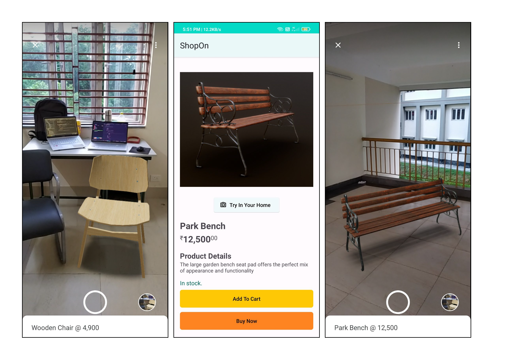

## Overview:
The AR Shopping App is an augmented reality-based shopping solution designed to enhance the online shopping experience. By leveraging Scene Viewer and ARCore, users can preview and interact with 3D models of products in real-time, helping them make more informed purchasing decisions regarding size, fit, and color.

## Features:
1. Augmented Reality (AR) Preview – View products in a real-world environment using AR.
2. Interactive 3D Models – Rotate, zoom, and inspect products before purchasing.
3. Product Filtering & Search – Quickly find items based on categories and preferences.
4. User Authentication – Secure login and signup with Firebase.
5. Shopping Cart & Wishlist – Add favorite products for future reference.
6. Seamless Checkout Process – Integration with payment gateways.
7. Dark Mode Support – UI adapts to user preferences.

## Screenshots of the application :

## How does it work?
We will be using **SceneViewer** by triggering a explicit intent to it. 
Scene Viewer is an immersive viewer that enables 3D and AR experiences from our Android app. It lets users of our application easily preview, place, view, and interact with web-hosted 3D models in their environment. It uses **ARCore**, which is Google’s platform for building augmented reality experiences. Using different APIs, ARCore enables our application to sense its environment, understand the world and interact with information.

ARCore uses three key capabilities to integrate virtual content with the real world as seen through your phone's camera:
1. **Motion tracking** allows the phone to understand and track its position relative to the world.
2. **Environmental understanding** allows the phone to detect the size and location of all type of surfaces: horizontal, vertical and angled surfaces like the ground, a coffee table or walls.
3. **Light estimation** allows the phone to estimate the environment's current lighting conditions.

## How quick can this technology be implemented ?
Our solution can be instantly be brought to production with the existing shopping applications for different products.

## Is the solution scalable ?
The solution is highly scalable as it can be implemented with the existing shopping applications.

## Business Relevance :
After bringing the idea to production, more and more users will be tempted to check out the products and the transition barrier from traditional offline buying to online would be reduced, thus increasing the sales.

## Use this application : 

1. You can clone the repository and import in Android Studio to see the code + build the APK.
